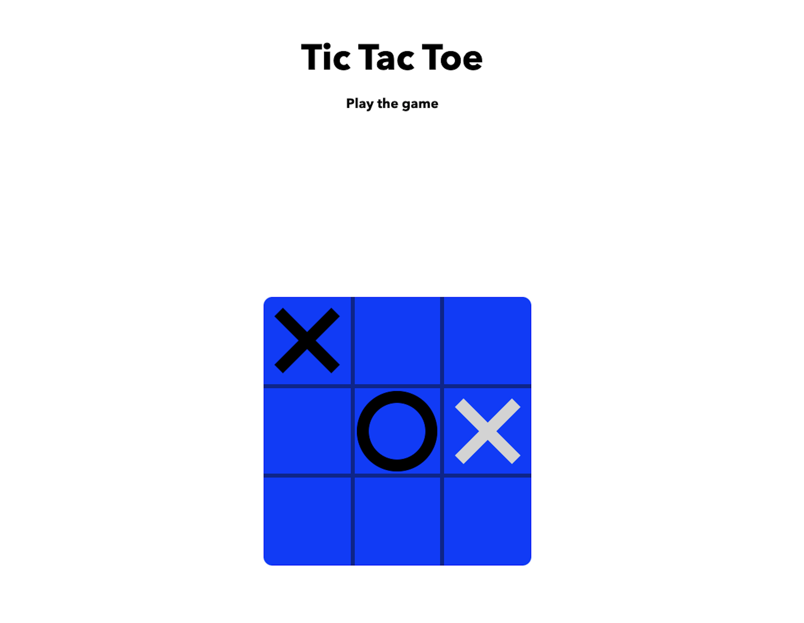
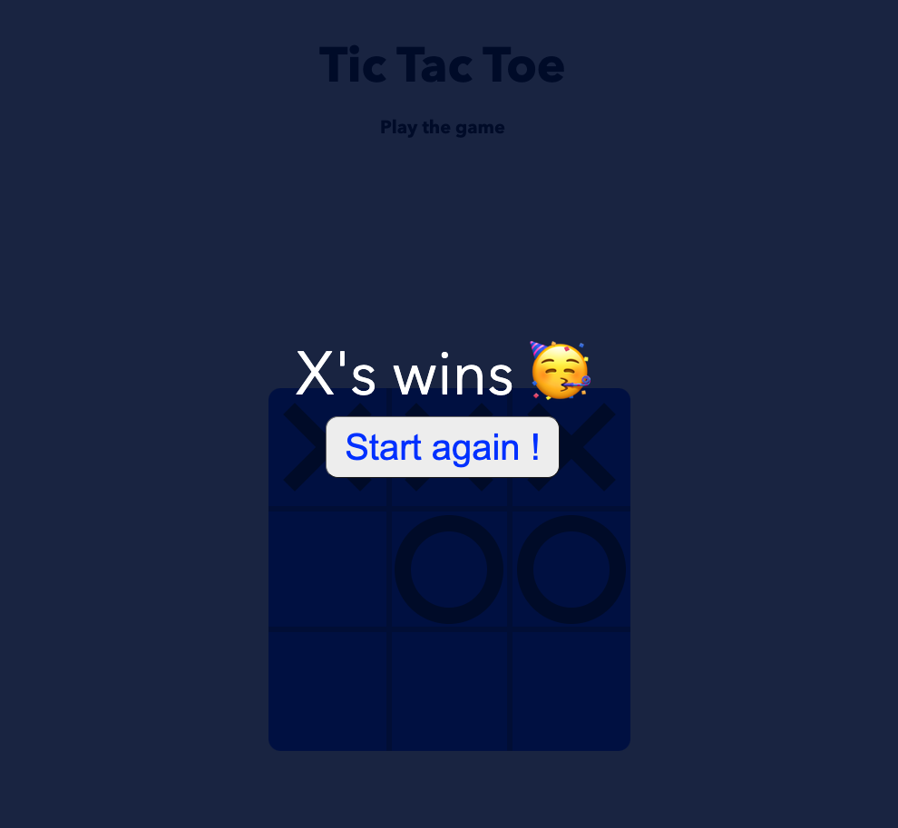

#  :robot: My Tic Tac Toe game

## Create an easy-to-use interface (UI/UX) by reproducing the famous tic-tac-toe game

## Illustration

## Language/tools
- HTML5 / CSS3 / CSS
- Javascript

## Goals 
- Work on approach on the implementation of functionalities
- Fundamentals Javascript
- UX / UI

## Rules 
Each player takes turns, applying either an X or an O on one of the squares.
The 1st player to make a line of 3 identical signs (vertical, horzintal or oblique) has won!

## Status
Project completed

## Context
Project developed as a web developer post diploma
